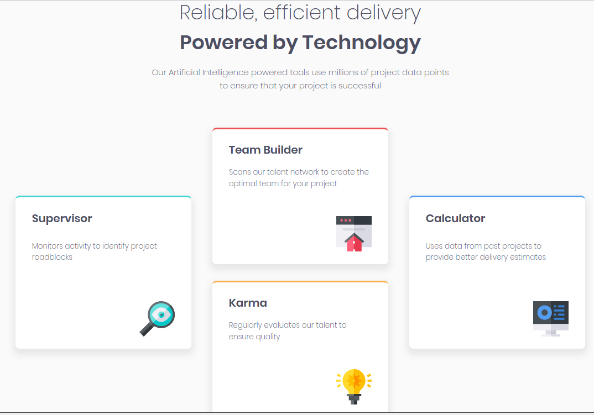
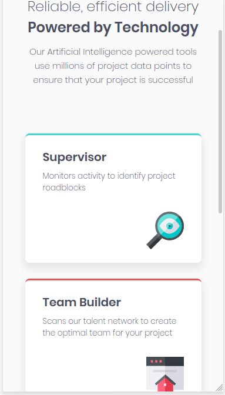

# Four Card Feature Section
> [Frontend Mentor](https://www.frontendmentor.io/)'s Four Card Feature Section

## Table of contents
* [General info](#general-info)
* [Screenshots](#screenshots)
* [Technologies](#technologies)
* [Setup](#setup)
* [Status](#status)
* [Inspiration](#inspiration)
* [Contact](#contact)

## General info
I did this to practise CSS Grid, since the four cards are in a very different configuration between mobile and desktop versions. Having done it, I then found that Internet Explorer treats grid gap quite differently and had to re-do where everything was on the grid.

## Screenshots

## Technologies
* HTML
* CSS Grid
* Gulp 4

## Setup
To view this project visit the [demo](https://four-card-feature-nm.netlify.app/) or download the files and open index.html

## Status
Project is: _finished_

## Inspiration
Design provided by [Frontend Mentor](https://www.frontendmentor.io/)

## Contact
Created by [nicm42](https://www.twitter.com/nicm4242) - feel free to contact me!
